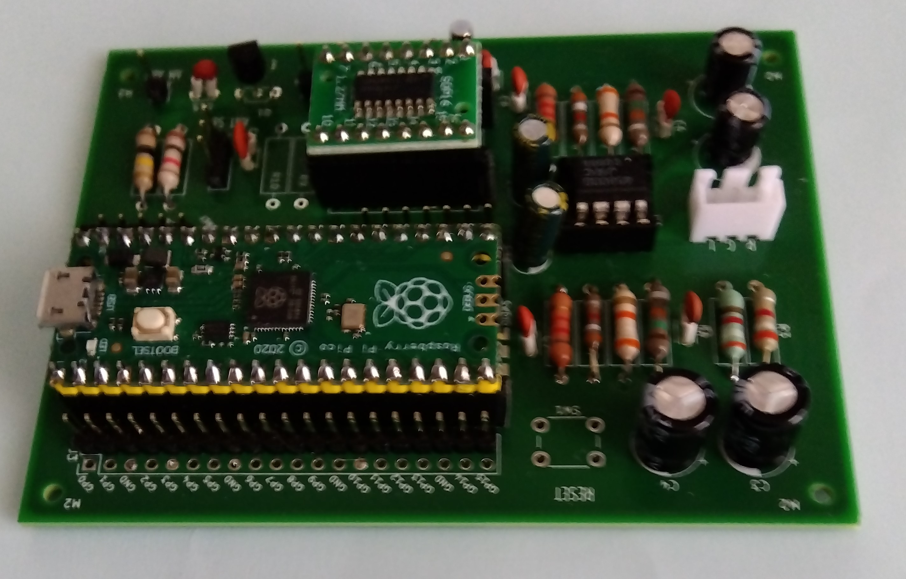
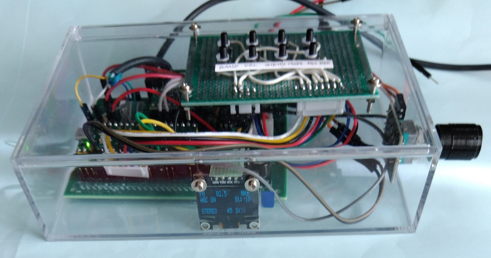

<H3>オールウェーブ DSPラジオIC SI4732をPi Picoで制御する</H3>

GitHubにあるSI4732の<a href="https://github.com/pu2clr/SI4735">ライブラリ</a>には、Pi PicoでSI4732を制御することができるとあり、"example"に例がある。 
ここでは、機能的に完結しているArduino Pro mini対応の"SI47XX_02_ALL_IN_ONE_OLED"をPi Pico用に改修した例を示す。 
開発はArduino IDE 2.1で行った。 

<strong>概要</strong> 
改修前のスケッチでは、操作をボタンとロータリーエンコーダーで行っている。これは、このまま変更しないことにする。I2Cとリセットのピンは変更する。 
なお、回路（"schematic2.pdf"）としては、SI4732のオーディオ出力不足を補うためと感度向上のため、オペアンプの増幅回路（ローパスフィルタ付）と 
トランジスタの高周波増幅回路を追加している。 
実装については基板（PCB）化を行った。 

<strong>H/W構成</strong> 
 ・Raspberry Pi Pico - コントローラ 
 ・I2C接続&nbsp; SI4732 
 ・I2C接続&nbsp; OLED表示装置(SSD1306) 
 ・ボタンとロータリーエンコーダー 
 ・オペアンプ NJM4580 
 ・高周波増幅 トランジスタ S9018 
 ・Xtal発振器（32768Hz）、抵抗・コンデンサ類、オーディオジャック、配線類 

 

<strong>接続</strong> 
各コンポーネントの接続は以下の通り。 

<table> 
<tr>
<td>I2C&nbsp;</td><td>Pi_Pico</td>
</tr>
<tr>
<td>SDA(SI4732,OLED)</td><td>20</td>
</tr>
<tr>
<td>SCK(SI4732,OLED)</td><td>21</td>
</tr>
<tr>
<td>RESET(SI4732)</td><td>22</td>
</tr>
</table>

*その他の接続については、スケッチを参照のこと 
**プルアップ抵抗は省略可 

<strong>インストール</strong> 
<ol>
<li>コードを、ZIP形式でダウンロード</li>
<li>追加のライブラリを、ZIP形式でダウンロード又はライブラリマネージャからインストールする</li>
 <ul>
  <li>SI4735（ライブラリマネージャから検索可）</li>
  <li>Tiny4kOLED（ライブラリマネージャから検索可）</li>
 </ul>
<li>ArduinoIDEからSI47XX_02_ALL_IN_ONE_OLED_pi_pico_master.inoを開く</li>
<li>「検証・コンパイル」に成功したら、一旦、「名前を付けて保存」を行う</li>
</ol>

<strong>若干の解説</strong> 
・STEPのボタン（エンコーダに接続）は、FM受信中は周波数のプリセット（変数"fmstation[] "に定義）切り替えとして動作する。 
・電源を入れるとPi PicoのLEDが点灯する。 
・変数"Band band[]"の４番目の定数は、バンド切り替え時の既定の受信周波数である。地域の放送局に合わせると良い。 

 

<strong>注意事項</strong> 
・利用の際は、自己責任でお楽しみください。 

